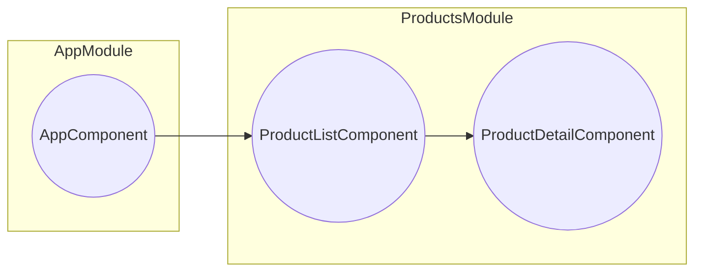
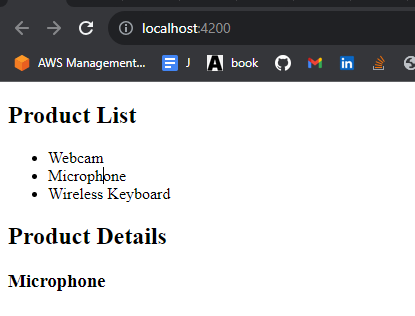

## Components

### WIKI
  - **Stand alone component**
    - component that is not registered with an ng module
    - does not need a compilation context from an ng module
      - bc: they import any ng artifacts they need by themselves
  - **Compilation context**
    - when we register a component with an ng module, we give it a compilation context
      - that component can find everything that needs to be loaded inside that context

### RULES:
  - ng components must be registered with only one ng module via `NgModule({declarations:[...]})`
  - importing a standalone @Component into a @NgModule(via import) makes the standalone component available module-wide
  - to register a component in a module, register it in @NgModule(via declarations)
    - this gives the component a compilation context

### FAQS
1. Standalone vs non standalone components
  - **Standalone Components:**
    - **Definition**: Independent entities
    - **Usage**: Often used as main application views
    - **Communication**: May use services or observables for inter-component communication
    - **Reusability**: Generally more reusable
    - **Complexity**: Typically simpler
    - **Isolation**: High level of isolation
    - **Dependencies**: Fewer external dependencies
    - **Example**: Individual page or sidebar component
    - **Use Cases**: Primary content holders
    - Others
      - can import ng modules and vice versa through `@NgModule({imports: [...]})`
      - does not need compilation context

  - **Non-Standalone Components:**
    - **Definition**: Part of a larger entity or module
    - **Usage**: Utilized within other components or services
    - **Communication**: Can use Input/Output decorators, services, observables, or other communication patterns
    - **Reusability**: Tightly coupled with specific context
    - **Complexity**: Can be more complex due to interactions
    - **Isolation**: Interactions within a module or context
    - **Dependencies**: More dependent on parent/containing components
    - **Example**: A header component used within multiple pages
    - **Use Cases**: UI elements, shared utilities, etc.

### Commands:
  - `ng generate component product-list`
    - will generate folder directory in app
      - ```bash
        src/app/product-list
        |-- product-list.component.css
        |-- product-list.component.html
        |-- product-list.component.spec.ts
        `-- product-list.component.ts
        ```
  - `ng generate component product --standalone`
    - generate a standalone component

### Sample
Given: 
  - Module: 
    - ProductModule
      - `ng generate module products`
  - Standalone Components:
    - Product
      - `ng generate component product --standalone`
  - Non standalone components:  
    - ProductList
      - `ng generate component product-list`

Code:
```ts
@NgModule({
  // register components here
  // registering components here will give component access to compilation context
  // standalone components SHOULD NOT  be added to declarations of an NG module
  // bc. it woulr make it registered with that module
  declarations: [
    ProductListComponent
  ],
  // import components here
  // importing makes a component available module-wide
  imports: [
    CommongModule,
    ProductComponent
  ]
})
export class ProductsModule { }
``` 

### Props(React 😂) in Angular
  - uses square brackets. eww
  - ```ts
    <span [innerText]="Hello World" />
    <span>{{ title }}</span>
    ```

### Input Binding


`product-detail.component.ts`
```ts
@Component({
  selector: 'app-product-detail',
  templateUrl: './product-detail.component.html',
  styleUrls: ['./product-detail.component.css']
})
export class ProductDetailComponent {
  @Input() name = '';
}
```

`product-detail.html`
```html
<h2>Product Details</h2>
<h3>{{ name }}</h3>
```

`product-list.component.ts`
```ts
@Component({
  selector: 'app-product-list',
  templateUrl: './product-list.component.html',
  styleUrls: ['./product-list.component.css']
})
export class ProductListComponent {
  selectedProduct = '';
}
```
`product-list.html`
```html
<h2>Product List</h2> 
<ul>
  <li (click)="selectedProduct = 'Webcam'">Webcam</li> 
  <li (click)="selectedProduct = 'Microphone'">Microphone</li> 
  <li (click)="selectedProduct = 'Wireless Keyboard'">Wireless Keyboard</li>
</ul>
<app-product-detail [name]="selectedProduct"></app-product-detail>
```

`products.modules.ts`
```ts
@NgModule({
  declarations: [
    ProductListComponent,
    ProductDetailComponent,
  ],
  imports: [
    CommonModule
  ],
  exports: [
    ProductListComponent,
  ]
})
export class ProductsModule { }
```


`app.module.ts`
```ts
@NgModule({
  declarations: [
    AppComponent,
  ],
  imports: [
    BrowserModule,
    ProductsModule
  ],
  providers: [],
  bootstrap: [AppComponent]
})
export class AppModule { }
```

`app.component.html`
```ts
<app-product-list></app-product-list>
```

Output:
  - 