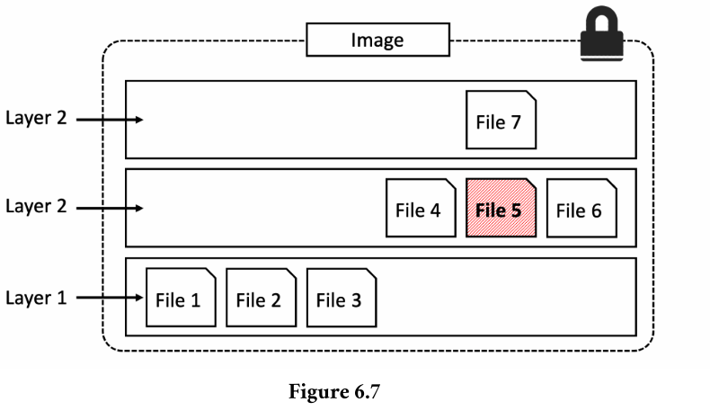
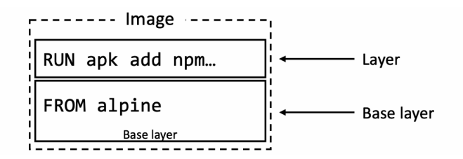
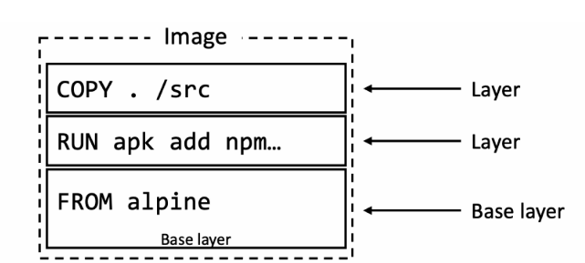
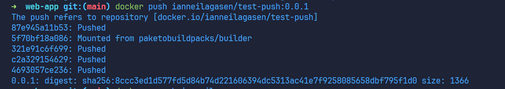
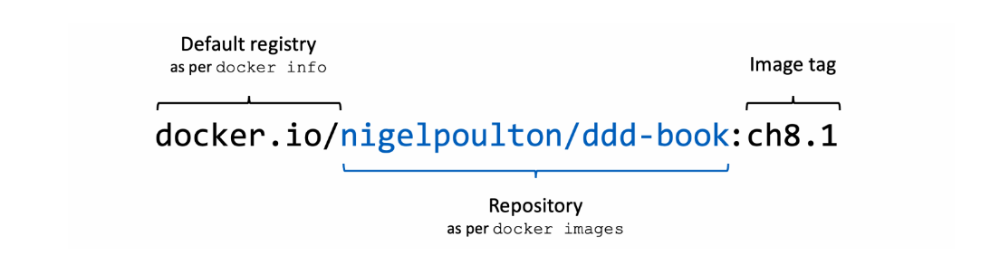
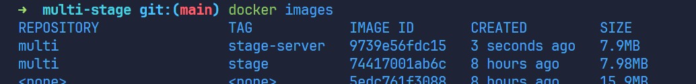
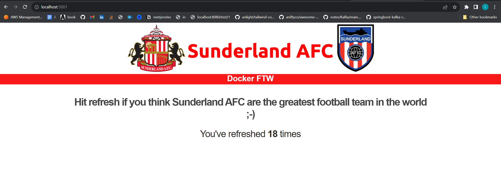
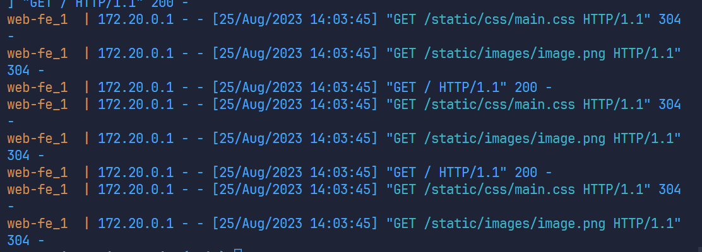

# Docker

## Glossary
1. **`DOCKERFILE`**
   - Instruction that will use by Docker to build the app
   - describes an application and tells Docker how to build it into an image
   - bridge the gap between developers and operations
2. **`Dangling Image`**
   - image that is no longer tagged and no repository name
   - occurs when building a new image with a tag that already exists
3. **`Image Digests`**
   - all images get a cryptographic `content hash` aka digest
   - immutable
   - as the digest is the hash of the content of the image
     - it is impossible to change the contents of the image w/o creating a new unique digest.
    - `docker images --digests alpine --format "{{.Digest}}"`
      - sha256:ec050c32e4a6085b423d36ecd025c0d3ff00c38ab93a3d71a460ff1c44fa6d77
4. **`Kernel`**
   - Core of OS,
   - responsible for managing resources, processes and hardware interaction
   - bridge between Hardware and Software
5. **`Docker Volumes`**
   - Exists outside of containers but can be mounted into them
6. **`Restart Policy`**
   - very basic form of self-healing that allows local Docker engine to automatically restart failed containers
   - applied per container
   - imperatively appliend in docker run commands, or declaratively in YAML files
   - restart policies: [always, unless-stopped, on-failure]
## Commands
  - **`docker images`**
    - list all images
    - options:
      - `--filter` / `docker images --filter [ARGS]`
        - args:
          - `dangling` true/false
            - `docker images --filter dangling=true`
            - list all dangling images
          - `before` req image name or ID as argument, 
            - `docker images --filter before=9213`
            - returns all images created before it
          - `after`
            - `docker images --filter since=9213`
            - returns images created after the specified image
          - `label` reqs the label or label value
            - `docker images --filter label=latest`
            - `docker images --filter "is-official=true"`
        - all other filterings may, use `reference`
          - `docker images --filter=reference="*:latest"`
            - list images tag as latest
      - `--format` - using Go template
        - `docker images --format "{{.Size}}"`
        - `docker images --format "{{.Repository}}: {{.Tag}}: {{.Size}}"`
  - **`docker images -q`**
    - list all the id of the images
  - **`docker image prune`**
    - delete all dangling image
  - **`docker image prune -a`**
    - delete all danglingh image + unused(by any containers) images
  - **`docker rmi <ARG>`**
    - ARG could be NAME:TAG, NAME, ID
    - docker rmi
  - **`docker rmi $(docker images -q) -f`**
    - delete all the images
    - same as `docker rmi $(docker images --filter "{{.ID}}") -f`
  - **`docker search <any>`**
    - `docker search nigelpoulton`
    - you can also add `--filter` similar to docker images
      - `docker search alpine --filter "is-official=true"`
  - **`docker pull <IMAGE_REFERENCE>@<DIGEST>`**
    - `docker pull ubuntu@sha256:ec050c32e4a6085b423d36ecd025c0d3ff00c38ab93a3d71a460ff1c44fa6d77`
  - **`docker history <ImageName/ID>`**
    - shows the build history of an image
    - shown from Dockerfile instructions such as "ENV", "EXPOSE", "CMD" ..
  - **`docker info`**
    - check the containerd, runc version, including default registry
  - **`docker manifest`**
    - inspect the manifest list of any image on Docker
    - `docker manifest inspect golang | grep 'architecture\|os'`
  - **`docker ps --filter ancestor=<IMAGE_ID>`**
    - list all containers from a given Image Id
  - **`docker run -it`**
    - run a new container
    - `-it` -> interactive and attach it to current terminal
  - **`docker stop`**
    - stop a container, but the configruation and contents still exists on the Docker host.
      - means that it can be restarted anytime
  - **`docker rm $(docker stop <IMAGENAME/ID>)`**
    - gracefully shutdown a container
    - 1st stop the container, this will return the id and use docker rm
  - **`docker rmi -f $(docker ps -aq)`**
    - Remove all containers, running or stopped
  - **`docker start <id | name>`**
    - start a stopped container
  - **`docker exec -it <id | name> bash`**
    - run bash against the container
  
## FAQs
1. How is Containers smaller, faster and more portable than traditional VMs
   - Shared OS Kernel
     - Containers share the host system Kernel
     - VMs run a complete guest OS on top of a hypervisor, including its own kernel and libraries
   - Resource Efficiency
     - Containers are lightweight because they share the host Kernel and utilize a layered file, 
       - allows multiple containers to share the same underlying resources w/o overhead of running muliple full OS instances
   - Fast Startup and Scaling
     - Containers can start almost instantly because they leverage the existing kernel
     - VMs take longer to start since they require booting up an entire guest OS
2. How to exit to a running container
   - CTRL + PQ or type exit
   - note you will just detach to the current container 
3. Why use multi-stage build? 
   - Single image, multi layer is large
     - each instruction in the Dockerfile adds a new layer in the image, increasing the size
     - ideally, you want the image to contain only the image that are required by the container
4. What are the top-level keys:
   - 1. services
   - 2. networks
   - 3. volumes
   - 4. secrets
   - 5. configs

## Running a containerized/dockerized application
1. Pull the dockerized application from github
   - `git clone https://github.com/nigelpoulton/psweb.git`
2. CD to the folder where Dockerfile is located
   - `cd psweb`
3. Inspect the dockerfile, It will have the instruction on how to build the infra
   - `code Dockerfile`
4. Build the Image for the Containerized App with the name:tag `ian_test:latest`
   - `docker build -t ian_test:latest`
   - `-t` tag for naming(name:tag) the image
5. Check if the image is create
   - `docker images`
6. Run the Container from the image
   - `docker run -d --name web1 --publish 8080:8080 ian_test:latest`
   - `-d` -> detached mode
   - `--name` --> name the container
   - `--publish` or `-p` --> expose the port, host:docker
7. Check if the containerized application is running
   - go to localhost:8080/

## Images:
  - dont include kernel.
    - containers share kernel of the host theyre running on
  - Official repositories -> from `https://hub.docker.com/_/`
    - nginx: https://hub.docker.com/_/nginx/
    - redis: https://hub.docker.com/_/redis/
    - https://hub.docker.com/_/mongo/
  - Images and Layers
    - image is a collection of loosely-connected read-only layers
      - each layer comprises one or more files
      - you can see layers by:
        - upon pulling
        - using `docker inspect ubuntu:latest`
    - Multiple images can and do share layers
      - space and performance efficiency
    - Updated versions of files is added as new layers to the image
      - EX:
        - 
        - here File 7 is an updated version of File 5
  - Image Hashes / Digests
    - Each image is identified by a crypto ID - hash of the manifest file
    - Each layer is identified by a crypto ID - hash of the layer content
    - means that changing the contents of the image or any of its layer
      - associated crypto hashes will change

## Containers

### Container Life Cycle
1. `docker run --name percy -it ubuntu:latest`
   - create a container from ubuntu image and named it percy 
2. `/bin/sh`
   - go to its terminal
3. ```bash
   cd tmp
   ls -l
   echo "Ian Agasen was here" > newfile
   ls -l
   cat newfile
   ```
   - create a new file in tmp directory
4. `CTRL + PQ` 
   - to exit the container
5. `docker stop percy`
   - stop the container
6. `docker ps`
   - check all the running containers, percy should not be listed
7. `docker start percy`
   - start the container
8. `docker exec -it percy bash`  
   - Connect to container using an interactive shell
9. cd tmp
   - check file if it exists.

### Persistent Nature of containers:  
  - The data created in this example is stored on the Docker hosts local filesystem.
    - If the Docker host fails, the data will be lost
  - Containers are designed to be immutable objects and its not a good practice to write data into them
    - For these reasons, Docker provides **volumes**  

### Stopping containers gracefully
1. `docker rm <container> -f`
   - the container is killed immediately without warning
   - it goes straight to SIGKILL
2. `docker stop` + `docker rm`
   - is betterm since it gives the process inside container ~10s to complete any task and gracefully shutdown
   - `docker stop` 
     - sends a `SIGTERM` signal to the main app process inside the container (PID 1)
       - SIGTERM ->  request to terminate 
     - if still running after 10s, it will issue a `SIGKILL`
       - SIGKILL -> terminate with force

### Self-healing containers with restart policy
  - Restart Policy
    - form of self-healing
    - allows local Docker engine to auto restart failed containers
    - applied per-container basis
    - configured imperatively via `docker run` or declaratively via YAML like Docker Compose / K8s
    - Restart Policies
      - `always`
        - always restart a failed container unless its been explicitly stopped
        - `docker run -it --restart always alpine bash`
          - once you exited the container, it will restart it
            - exit command will kill the container
          - feature:
            - when you stop(EXITED) a container, then restart the Docker daemon
              - it will also restart the container
      - `unless-stopped`
        - similar to `--restart always`, but container will not be restarted if was previously stopped and Docker daemon restart
      - `on-failure`
        - will restart a container if it exits with a  non-zero exit code
        - will also restart containers when Docker daemon restarts, including stopped states
    - using YAML:
      - ```yaml
        services:
          myservice:
            <snip>
            restart_policy:
              condition: always | unless-stopped | on-failure
        ```

## Containerizing an app
   - Dockerfile should be located in the `Build Context`

Sample Dockerfile
```Dockerfile
# Test web-app to use with Pluralsight courses and Docker Deep Dive book
FROM alpine

LABEL maintainer="nigelpoulton@hotmail.com"

# Install Node and NPM
RUN apk add --update nodejs npm curl

# Copy app to /src
COPY . /src

WORKDIR /src

# Install dependencies
RUN  npm install

EXPOSE 8080

ENTRYPOINT ["node", "./app.js"]
```
  - Start with alpine image
  - make a note that "nigelpoulton@hotmail.com" is the maintainer
  - Copy everything from build context to the /src directory in the image
  - Set the working directory as /src
  - install dependencies
  - set the app.js to run

Sample Dockerfile for SpringBoot App
```Dockerfile
FROM eclipse-temurin:17-jre-focal
COPY target/dockerdemo-0.0.1-SNAPSHOT.jar /src/app.jar
WORKDIR src
EXPOSE 8080
CMD ["java", "jar", "app.jar"]
```
   - to containerize the app / to build the image:
     - `docker build -t ian_app:latest .`
   - to run a container based on the image
     - `docker run --name ian_app --publish 8080:8080 ian_app:latest`

## Dockerfiles
  - `FROM`
    - Dockerfile instruction starts with `FROM` directives
    - pull an image that will be used as the base layer
    - everything else will be added as new layers above the base layer
    - refers to a Linux based image
    - 
  - `RUN`
    - command to execute
    - ex: `RUN apk add --update nodejs-npm`
      - it uses apk package manager to install nodejas and nodejs-npm into the image
      - it does this by adding a new layer from the base image
      - take note: `apk` should be available in the base layer
    - 
  - `COPY`
    - ex: `COPY . /src`
      - creates a new layer and copies application and dependency files from the build context
    - 
  - `WORKDIR`
    - ex: `WORKDIR /src`
      - Dockerfile uses the WORKDIR directive to set the working directory for the rest of the instructions
      - creates metadata and **does NOT create a new image layer**

### Pushing a build image to DockerHub
  - 1. Login
    - `docker login`
  - 2. Tag the image
    - `docker tag <image-name>:<tag-name> <username>/<image-name>:<tag-name>`
    - Ex: `docker tag test-ian:latest ianneilagasen/test-push:0.0.1`
  - 3. Push the image
    - `docker push <username>/<image-name>:tag-name`
    - Ex: `docker push ianneilagasen/test-push:0.0.1`
    - 
    - 


## Moving to production with Multi-stage Builds
  - Big Docker Images is bad
    - slow,
    - more potetntion vulnerabilities
    - bigger attack surface
  - Solution: Multi Stage Builds
    - Perform build in parallel

Sample Multistage dockerfile:
```dockerfile
FROM golang:1.20-alpine AS base
WORKDIR /src
COPY go.mod go.sum .
RUN go mod download
COPY . .

FROM base AS build-client
RUN go build -o /bin/client ./cmd/client

FROM base AS build-server
RUN go build -o /bin/server ./cmd/server

FROM scratch AS prod
COPY --from=build-client /bin/client /bin/
COPY --from=build-server /bin/server /bin/
ENTRYPOINT [ "/bin/server" ]
```
NOTE from above Dockerfile:
  - it has 4 FROM instructions
    - Stage 0 --> base
    - Stage 1 --> build-client
    - Stage 2 --> build-server
    - Stage 3 --> prod
  - each stage outputs an image that can be used by other stages
    - these intermediate images are cleaned up when the final build completes
  - Base stage goal:
    - create a reusable build image

### Sample of Inefficient Dockerfile that can be solve by multilayer
```Dockerfile
# Unoptimal image: 636 MB
FROM maven:3.6.3-adoptopenjdk-11 as base
WORKDIR /opt/demo
COPY . .
RUN mvn clean package -Dmaven.test.skip=true
```

Using multistage
```Dockerfile
# KEEP IN MIND: we only need the JRE not the JDK

# Stage 0
# initialize build and set base image
FROM maven:3.6.3-adoptopenjdk-11 as stage0

# Speed up maven a bit
ENV MAVEN_OPTS="-XX:+TieredCompilation -XX:TieredStopAtLevel=1"

# Set working directory
WORKDIR /opt/demo

# copy just pom.xml
COPY pom.xml .

# go offline using the pom.xml
RUN mvm dependency:go-offline

# copy other files
COPY ./src ./src

# compile the source code and package it in a jar
RUN mvm clean install -Dmaven.test.skip=true

##############

# Stage 1
# Set base image for second stage
FROM adoptopenjdk11-jre-11.0.9_11-alpine

# set deployment directory
WORKDIR /opt/demo

# Copy over the build artifact from the maven image
# Here demo.jar is a placeholder for the artifactId
COPY --from=stage0 /opt/demo/target/demo.jar /opt/demo
```
- CI/CD pipeline
  - With multi stage Dockerfile
    - CI/CD pipelince can focus on `building` the applcation in the build stage, then
    - `package` the runtime artifact in the final stage


### Multi-stage builds and build targets
  - Build multiple images from a single Dockerfile
From these example we may want to create separate images for the client and server. We can do these by splitting the final `prod` stage in the Dockerfile into two stages
```dockerfile
FROM golang:1.20-alpine AS base
WORKDIR /src
COPY go.mod go.sum .
RUN go mod download
COPY . .

FROM base AS build-client
RUN go build -o /bin/client ./cmd/client

FROM base AS build-server
RUN go build -o /bin/server ./cmd/server

FROM scratch AS prod
COPY --from=build-client /bin/client /bin/
COPY --from=build-server /bin/server /bin/
ENTRYPOINT [ "/bin/server" ]
```

Dockerfile with 2 separate image
```Dockerfile
FROM golang:1.20-alpine AS base
WORKDIR /src
COP go.mod go.sum .
RUN go mod download
COPY . .

FROM base AS build-client
RUN go build -o /bin/client ./cmd/client

FROM base AS build-server
RUN go build -o /bin/server ./cmd/server

FROM scratch AS prod-client
COPY --from=build-client /bin/client /bin/
ENTRYPOINT [ "/bin/client" ]

FROM scratch AS prod-server
COPY --from=build-server /bin/server /bin/
ENTRYPOINT [ "/bin/server" ]
```
- to build the 2 image, build separately the build targets for each final stage
  - Syntax:
    - ```Dockerfile
      docker build -t <name>:<tage> --target <build-target> .
      ```
  - docker build -t multi:client --target prod-client .
  - docker build -t multi:server --target prod-server .




### Docker Compose
  - structured/declarative way to contain normal docker commands
Sample docker run command
  - takes care of creating a common Network
  - to run docker compose
    - `docker-compose -f mongo.yaml up`
      - `-f <ARG>` -> file 
      - `up` -> start all container declared
  - stopping all container (including the network)
    - `docker-compose -f mongo.yaml down`
      - stop all container (including the network)
```sh
docker run -d \
  --name mongodb \ 
  -p 27017:27017
  -e MONGO_INITDB_ROOT_USERNAME=admin \
  -e MONGO_INITDB_ROOT_PASSWORD=password \
  --net mongo-network \
  mongo

docker run -d \
  --name mongo-express \
  -p 8080:8080 \
  -e ME_CONFIG_MONGODB_ADMINUSERNAME=admin \
  -e ME_CONFIG_MONGODB_ADMINPASSWORD=password \
  -e ME_CONFIG_MONGODB_SERVER=mongodb \
  --net mongo-network \
  mongo-express
```

Docker compose
```yaml
version: 3
services:
  # container name
  mongodb:
    image: mongo
    ports:
      - 27017:27017
    environmet:
      - MONGO_INITDB_ROOT_USERNAME=admin
      - MONGO_INITDB_ROOT_PASSWORD=password
  
  mongo-express:
    image: mongo-express 
    ports:
      - 8080:8080
    environment:
      - ME_CONFIG_MONGODB_ADMINUSERNAME=admin
      - ME_CONFIG_MONGODB_ADMINPASSWORD=password
      - ME_CONFIG_MONGODB_SERVER=mongodb
```

### Top Level Docker Compose Keys
  - 1. `services`
    - define applications microservices
      - EX: a web front end, an in-memory cache called redi
        - compose will deploy each of these microservices to its own container
  - 2. `networks`
    - tell docker to create new networks
    - by default, modern versions of Compose create `overlay` networks that span multiple hosts.
      - however `driver` property can be used to specify different network types
    - creating a new overlay network called *over-net*
      - ```yaml
        networks:
          over-net: # network name
          driver: overlay
          attachable: tru
        ```
  - 3. volumes 
    - tell docker to create new volumes

### Sample Docker Compose file
```yaml
version: 3.5

services:
  web-fe:
    build: .
    command: python app.py
    ports:
      - target: 8080
        published: 5001
    networks:
      - counter-net
    volumes:
      - type: volume
        source: counter-vol
        target: /app
  
  redis:
    image: "redis:plane"
    networks:
      counter-net:
  
networks:
  counter-net:
volume:
  counter-vol:
```
  - The service section has 2 2nd level keys:
    - web-fe
    - redis
    - each of thes defines a microservices
      - Compose will deploy each as its own container
    - Definition of each keys:
      - web-fe
        - `build: .`
          - tells docker to build a new image using Dockerfile in the current directory (.)
          - newly built image will be used in a later step to create the container for this service
        - `command: python app.py`
          - run a python app called app.py in every container for web-fe service
          - app.py should exist and Python must be installed
            - This is done in the Dockerfile which is build by the `build: .` step
          - **NOTE** python app.py could already be defined in the Dockerfile.
            - This ex. shows that we can override instructions set in Dockerfiles
        - `ports:`
          - tells docker to map port `8080` inside the container(`target`) to port `5001` on the host(`published`)
            - means, traffic from Docker host port 5001 will be directed to port 8080 on the container
            - app inside the container listens on port 8080
        - `networks`
          - which network to attach the service's containers to.
          - network should already exists or be defined in the networks top-level key
        - `volumes`
          - mount the `counter-vol` volume (`source:`) to `/app`
      - redis:
        - start a standalone container called redis based on the `redis:alpine` image
          - image will be pulled from Docker Hub
    - Running the Docker Compose file
      - `docker-compose up &`
        - `docker-compose up`
          - starts the services in the compose.yaml file
        - `&`
          - runs the services in the background
      - 
    - Logs
      - 