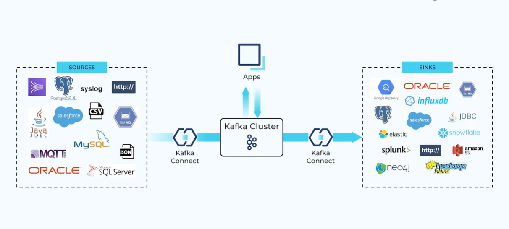
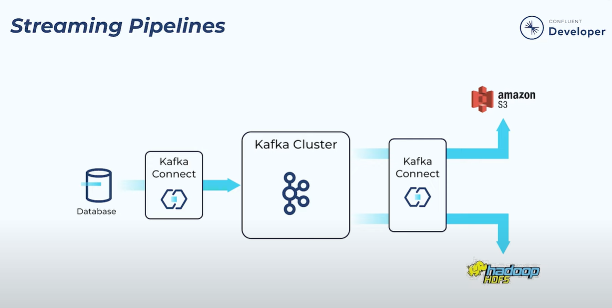

# KAFKA CONNECT

## What it is
  - 
  - Use Cases
    - Streaming Pipelines
      - 
  - Integrate easily data systems with Kafka

## Why not writer our own integrations?
  - You need to consider:
    - Handling failures and restarts
    - Logging
    - Scaling up and down to meet varying data loads
    - Running across multiple nodes
    - Serialization and data formats
  - Is this worth it?

## 