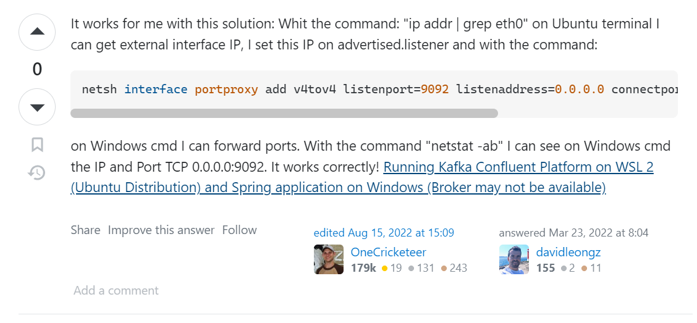

## By Stephane Maarek

### Conduktor
How Company Start

Source System -> Target System
ETL

Company Evolve
Many Source
Many Target
Ex: 4 source systems -> 6 target systems:
You need to write 24 integrations
Each integration comes with difficulties around:
  - Protocol
    - how the data is transported(TCP, HTTP, REST, FTP, JDBC)
  - Data Format
    - how the data is parsed(Binary, CSV, JSON, AVRO, ProtoBuff)
  - Data Schema and Evolution
    - how the data is shaped and may changed

Each source system will have an increased load from the connections

## **`Why Apache Kafka:`**

Decoupling of data streams & systems
Source System 
  - Producer 
    - creates data stream / data created real time
    - Ex: 
      - Website Events
      - Pricing Data
      - Financial Transactions
      - User Interactions
Target System 
  - Consumer
    - Ex:
      - Database
      - Analytics
      - Email System
      - Audit


Why Apache Kafka
  - Distributed, resilient architecture, fault tolerance
  - Horizontal Scalability
    - Can scale to 100s of brokers
    - Can scale to millions of messages per second
  - High Performance (latency of less than 10ms) - real time

## **`Use Cases:`**
  - Messaging System
  - Activity Tracking
  - Gather metrics from many different locations
  - Application Logs gathering
  - Stream processing (with the Kafka Streams API for example)
  - De-coupling of system dependencies
  - Integration with Spark, Flink, Storm, Hadoop and other Big Data technologies
  - Micro-services pub/sub

## **`How company uses Kafka`**
  - Netflix:
    - use Kafka to apply recommendations in real time while youre watching TV shows
  - Uber: 
    - uses Kafka to gather user, taxi and trip data in real-time to compute and forecast demand, and compute surge pricing in real time
  - LinkedIn
    - uses Kafka to prevent spam, collect user interactions to make better connection recommendations in real-time
  - Remember: Kafka is only used as a transportation mechanism


## **`Kafka Architecture Overview`**
|-Component-|-Role-|
|-----------|------|
| Producer | Sends messages to Kafka |
| Consumer | Retrieves messages from Kafka |
| Topics | Logical name of where messages are stored in the broker |
| Zookeeper ensemble | Helps maintain consensus in the cluster | 
| Broker | handles the commit log (how messages are stored in the disk ) | 


## **`Kafka Topics`**
Topics 
  - parictular stream of data in a Kafka Cluster
  - similar to a table in a DB (w/o all the constraints)
  - identify a topic bi its `name`
  - support any kind of message format (JSON, text file)
  - The sequence of messages is called a `data stream`
  - You can not query topics, instead,
    - use Kafka Producers to send data
    - use Kafka Consumers to read data
    - 
  - Streams/sequence of related "messages" or events 
    - is a logical representation
    - it categorize messages into `Groups`
  - Developers are defined by Topics
  - Producer <- -> Topic: N - N relationship
    - Unlimited no. of Topics

## **`Partitions and offsets`**
- Topics are split in `partitions`(Ex: 100 partitions)
  - Messages that are sent within Kafka topic
  - Messages within each partition are ordered
  - Each message within a partition gets and incremental id, called `offset`
  - 
  - Kafka topics are immutable: once data is written to a partition, it cannot be changed
    - data cannot be deleted or update
    - keep on writing through partition
    - data should only flow
  - You can have as many partitions per topic as you want

Data in Kafka is kept only for a limited time 
  - `Retention Policy` (default is one week - configurable)

Offsets
  - Offsets only have meaning for a specific partition
    - Ex: offset 3 in partition 0 doesnt represent the same data as offset 3 in partition 1
    - Offsets are not re-used even if previous messages have beed deleted
  - **Order is guaranteed** only within a partition (not across partitions)
  - Offsets are unique identifiers assigned to individual message within a partition
    - they indicate the position of a message in the partition's message sequence/stream
  - Offsets are used by Consumers to keep track of their progress while reading messages from partitions


## **`Topics, Partitions and Segments`**
  - 
  - Topic is a log, it is persistent, it will be stored
    - Segments are the units that will be stored|
  - Topics are broken down into Partitions

Why are Topics broken down into Partitions?
  - `Scalability`, by dividing a topic into partitions, Kafka can:
    - horizontally scale to handle high data throughput.
    - Each partition can be processed independently
      - allows multipler producers and consumers to work concurrently w/o bottlenecks
    - handle volumes of data and support high traffic workloads
  - `Parallel Processing`
    - Multiple consumers can read from different partitions of the same topic simultaneously
  - `Higher Throughput`
    - since each partition can be handled separately by Kafka brokers,
      - system can handle more write and read operations
      - leads to better throughput and reduced latency compared to asingle-threaded system
  - `Balancing Load`
    - it allows even distribution of data across brokers and consumers
  - `Fault Tolerance`
    - Each partition is replicated across multiple Kafka brokers, forming a replication group
    - if one broker fails, another broker within the replication group can take over
    - Replication also prevents data loss since it also stores the data

## **`Producers`**
Producers
  - write data to topics(which are mady by partitions)
  - know to which partition to write to (and whichKafka broker has it)
  - In case of Kafka broker failuers, Producers will automatically recover

Producer Message keys:
  - Producers can choose to send a key with the message (string, number, binary)
  - if key = null, data is sent round robin (partition 0, then 1, then 2...)
  - if key != null, the all messages for that key will always go to the same partition
  - A key are typically send if you need message orrdering for a specific field (ex: truck_id)
    - 

## **`Kafka Message Anatomy`**
`Message` / `Record`
  - basic piece of data flowing through Kafka
  - Messages are how Kafka represents your data
  - Each message has a:
    - timestamp
    - key-value pairs
    - optional headers
  - 
  - Each key and value can interact in its own specific ways to serialize or deserialize its data
  - 


## **`Kafka Message Serializer`**
Kafka Message Serializer
  - Kafka only accepts bytes as an input from producers and sends bytes out as an output to consumers
  - `Message Serialization` means transforming objects / data into bytes
  - They are used on the value and the key
    - 


## **`Kafka Consumers`**
Consumers
  - read data from a topic(identified by name) - pull model
  - may read from 1 or more Partition from a topic
  - automatically know which broker to read from
  - In case of broker failures, consumers know how to recover
  - Data is read in order from low to high offset `within each partitions`
  - Consumer can be a Producer to another messaging system


## **`Decoupling Producers and Consumers`**
  - Producers and Consumers are decoupled
  - Slow Consumers do not affect Producers
  - Add Consumers without affecting Producers (For Scaling)
  - Failure of Consumer does not affect System
  - They can fail independently, they can evolve independently
  - they dont know each other
  - they are decoupled by the cluster


## **`Zookeeper (Ensemble) - Deprecate KIP 500`**
  - cluster management
  - Failure detection & recover
  - Store ACL and secrets
  - Elect leaders
  - This is now handled by Kafka Raft - Kafka w/o Zookeeper


## **`Consumer Deserialization`**
Deserializer
  - indicates how to transform
  - consumer must know in advance the format of the message
  - 


## **`Consumer Groups`**
Consumer Groups:
  - All the consumers in an application read data as a consumer groups
  - Each consumer within a group reads from exclusive partitions
  - 
  - What if too many Consumer?
    - Some consumers will be inactive - bottle neck
    - no. of consumer > no. of topic
    - 
  - It is acceptable to have multple consumer groups on the same topic
  - 
  - Why multiple consumer groups?
    - 1 consumer group per service
      - Ex: 1 consumer group for location service, and 1 for notification service reading the same message
  - To create distinct consumer groups, use the consumer property `group.id`
  

## **`Consumer Offsets`**
  - Kafka stores the offsets at which a consumer group has been reading
  - The offsets committed are in Kafka topic named `__consumer_offsets`
  - When a consumer in a group has processed daata received from Kafka, it should **periodically committing the offsets** 
    - Kafka broker will write to `__consumer_offsets`, not the group itself
    - can also indicate how far the consumer has succesfully reading into the Kafka Topic
    - when failure, it can go back to the latest committed state


## **`Delivery semantics for consumers`**
  - By default, Java COnsumers will automatically connit offsets (at least one)
  - There are 3 delivery semantics if you choose to commit manually
    - `At lease once (usualy preferred)`
      - Offsets are committed after the message is processed
      - If the processing goes wrong , the message will be read again
      - This can result in duplicate processing of messages. Make sure your processing is `idempotent` 
        - means, proccesing again the messages wont impact your systems
    - `At most once`
      - offsets are committed as soon as messages are received
    - `Exactly once`
      - For Kafka => Kafka workflows: use the Transactional API (easy with Kafka Streams API)
      - For Kafka => External System workflows: use an idempotent consumer

## **`Kafka Brokers`**
  - A kafka cluster is composed of multipler brokers (servers)
  - Each broker is identified with its id
  - Each broker containers certain topic partitions
  - After connecting to any broker(called a boostrap broker), you will be connected to the entire cluster
  - A good number to get started is 3 brokers, some big clusters have over 100 brokers
  
  - Brokers can be thought of as the server side of Kafka
    - Before VMs and K8s, broker are hosted using physical server


## **`Brokers and Topics`**
  - Example of Topic-A with 3 partitions and Topic-B with 2 partitions
  - Note: data is distributed, and broker 103 doesnt have any topic B data
  - 


## **`Kafka Broker Discovery`**
  - Each Kafka broker is also called a `bootstrap server`
    - means that `you only need to connect to one broker`, and the Kafka clients will know how to be connected to the entire cluster (smart clients)
    - 
  - Each broker knows about all brokers, topics and partitions (metadata)


## **`Topic Replication Factor`**
  - Topics should have a replication `factor > 1 (usually between 2 and 3)`
  - This way if a broker is down, another broker can have the data and can serve the data
  - Example: Topic-A with 2 partitions and replication factor of 2
  - 
  - If we lose Broker 102
    - Broker 101 and 103 can still serve the data, they have replica of Topic A

## **`Concept of Leader for a Partition`**
  - At any time only ONE broker can be a leader for a given partition
  - Producers can only send data to the broker that is leader of a partition
    - The other brokers will replicate the data
    - Therefore, each partition has one leader and multiple ISR(in-sync replica)
    - 
  - Kafka Consumers by default will read from the leader broker for a partition

## **`Kafka Consumers Replica Fetching (Kafka v2.4+)`**
  - It is possible to configure consumers to read from the closest replica
  - This may help to improve latency, and also decrease network costs if using the cloud
  - 
    - In this example, the consumer is reading from the replica, not the leader

## **`Producer Level Message Compression`**
  - Producer usually send data that is text-based, for example with JSON data
  - It its important to apply compression to the producer
    - less memory
  - Compression can be enabled at the Producer level and does not require any configuration change in the Brokers or in the Consumers
  - compression.type can be:
    - none (default)
    - `gzip`
    - `lz4`
    - `snappy`
    - `zstd` (Kafka 2.1)
  - Compression is more effective the bigger the batch of message being sent to Kafka!
    - 
  - Advantages:
    - Much smaller producer request size (compression ratio up to 4x!)
    - Faster to transfer data over the network => less latency
    - Better throughput
    - Better disk utilisation in Kafka (stored messages on disk are smaller)
  - Disadvantages (very minor)
    - Producer must commit some CPU cycles to compressions
    - Consumers must commit some CPU cycles to decompressions
  - Overall:
    - Consider testing `snappy` or `lz4` for optimal speed / compression ration
    - Consider tweaking `linger.ms` and `batch.size` to have bigger batches, and therefor more compression and higher throughput
    - Use compression in production


## **`Broker/Topic Level Message Conversion`**
  - There is also a setting you can set at the broker level (all topics) or topic-level
  - `compression.type=producer` (default)
    - the broker takes the compressed batch from the producer client and writes it directly to the topic's log file without recompressing the data
    - pushes the necessity of compression at the producer
  - `compression.type=none`
    - all batches are decompressed by the broker
  - `compression.type=lz4`
    - if its matching the producer setting, data is stored on disk as is
    - if its a different compression setting, batches are decompressed by the broker and then redecompressed using the specified compression algorithm
  - `WARNING` : If you enable broker side compression, it will consume extra CPU cycles. Optimal is using Producer Level Message Conversion


## **`linger.ms & batch.size`**
  - by default, Kafka producers try to send records as soon as possible
    - It will have up to `max.in.flight.requests.per.connection=5`, meaning up to 5 message batches being in flight (being sent between the producer in the broker) at most
    - After this, if more messages must be sent while others are in flight, Kafka is smart and will start batching them before the next batch send
  - Smart batching helps increase throughput while maintaining very low latency
    - Added benefit: batches have higher compression ratio so better efficiency
  - Two settings to influence the batching mechanism
    - `linger.ms` (default 0)
      - how long to wait until we send a batch
      - Adding a small number, for example, 5 ms helps add more messages in the batch at the expense of latency
    - `batch.size` (default 16KB)
      - max number of bytes that will be included in a batch
      - Increasing a batch size to something like 32KB or 64 KB can help increasing the:
        - compression
        - throughput
        - efficiency of requests
      - Disadvantage of increasing the batch size
        - may increase memorey usage on the producer side
        - increase latency, as the producer will wait for the batch to fill  up
      - Any message that is bigger than the batch size will not be batched
      - A batch is allocated per partition, so make sure that you dont set it to a number thats too high, otherwise youll run waste memory!
      - if a batch is filled before `linger.ms`, increase the batch size
    - 

## **`High Throughput Producer`**
  - increase the `linger.ms` and the producer will wait a few milliseconds for the batches to fill up before sending them
  - if you are sending full batches and have memory to spare, you can use `batch.size` and ssend larger batches
  - Introducer some producer-level compression for more efficiency in sends
  - ```java
    // high troughput producer (at the expense of a bit of latency and CPU usage)
    properties.setProperty(ProducerConfig.COMPRESSION_TYPE_CONFIG, "snappy");
    properties.setProperty(ProducerConfig.LINGER_MS_CONFIG, "20");
    properties.setProperty(ProducerConfig.BATCH_SIZE_CONFIG, Integer.toString(32*1024))
    ```
  - What is Producer Throughput:
    - This refers to how quickly the Kafka producer can send messages to the Kafka broker. 
    - Higher producer throughput means the producer can send more messages to Kafka in a given time frame. 
    - To achieve higher producer throughput, various factors come into play, such as message size, batch size, compression settings, and network latency.
  - What is Latency
    - refers to the time it takes for a single message to be sent from the producer to the Kafka broker
    - Low latency means that messages are sent quickly with minimal delay.
  - Latency vs Throughput
    - ⬆️ Larger Batches, ⬇️ Lower Latency
      - When you increase the producer's throughput by sending more messages in each batch or increasing the number of messages sent per unit of time, the latency tends to decrease.
        - This is because the producer accumulates more messages before sending them in a batch, reducing the overhead of establishing a new connection and sending individual messages.
      - By batching multiple messages together, the producer can send them in one network request, reducing the per-message overhead. 
      - This batching approach typically leads to lower latency as the number of network requests is reduced.

## **`Producer Acknowledgements (acks)`**
  - Producers can choose to receive acknowledgements of data writes
    - confirmation that write successfully happend
    - `acks=0`
      - Producer wont wait for acknowledgement (possible data loss) 
    - `acks=1`
      - Producer will wait for leader acknowledgement (limited data loss)
    - `acks=all`
      - Leader + Replicas acknowldgement (no data loss)
  - 

## **`Kafka Topic Durability`**
  - For a topic replication factor of 3, topic data durability can withstand 2 brokers loss
  - As a rule, for a replication factor of N, you can permanently lose up to N-1 brokers and still recover your data

## **`Zookeeper`**
  - manages brokers (keeps a list of them)
  - helps in performing leader election for partitions
  - sends notifications to Kafka in case of changes:
    - eg: new topic, broker dies, broker comes up, delete topics
  - Kafka 2.x cant work without Zookeeper
  - Kafka 3.x can work without Zookeeper(KIP 500) - using Kafka Raft instead
  - Kafka 4.x will not have Zookeeper
  - Zookeeper by design to operates with an odd number of servers(1, 3, 5, 7)
  - Zookeeper has a leader (writes) the rest of the servers are followers (reads)
  - (Zookeeper does NOT store consumer offsets with Kafka > v0.10)
  - Zookeeper Cluster (`ensemble`)
  - 
  - Should you use Zookeeper?
    - With Kafka Brokers?
      - Yes, until Kafka 4.0 is out
      - while waiting forr Kafka without Zookeeper to be production ready
    - With Kafka Clients?
      - Over time, the Kafka clients and CLI have been migrated to leverage the brokers as a connection endpoint instead of Zookeeper
      - Since Kafka 0.10, consumers store offset in Kafka and Zookeeper, and must not connect to Zookeeper as its deprecated
      - Since Kafka 2.2, the kafka-topics.sh CLI command references Kafka brokers and not Zookeeper for topic management (creation, deletion, etc)
      - as a modern day Kafka developer. never use Zookeeper as a configuration in your Kafka clients, and other programs that connect to Kafka as it is unsecure

## **`About Kafka KRaft`**
  - KIP 500 - Kafka project started to work to remove the Zookeeper dependency
  - Zookeeper shows scaling issues when Kafka clusters have > 100_000 partitions
  - By removing Zookeeper, Kafka can:
    - Scale to millions of partitions, and becomes easier to maintain and set-up
    - improves stability, makes it easier to monitor, support and admin
    - Single security model for the whole system
    - Single process to start with Kafka
    - Faster controller shutdown and recovery time


## **`Starting Kafka`**
  - 
  - https://www.conduktor.io/kafka/how-to-install-apache-kafka-on-windows-without-zookeeper-kraft-mode/
  - install wsl2
    - ```bash
      wsl --install
      ```
  - Enter new username and password
    - 
  - Once you create a User Name and Password, the account will be your default user for the distribution and automatically sign-in on launch.
  - This account will be considered the Linux administrator, with the ability to run sudo (Super User Do) administrative commands.
  - Disable IPv6 on WSL2
    - ```bash
      sudo sysctl -w net.ipv6.conf.all.disable_ipv6=1
      sudo sysctl -w net.ipv6.conf.default.disable_ipv6=1
      ```
  - Installing Java JDK 11 on WSL2
    - ```bash
      wget -O- https://apt.corretto.aws/corretto.key | sudo apt-key add - 
      sudo add-apt-repository 'deb https://apt.corretto.aws stable main'
      sudo apt-get update; sudo apt-get install -y java-11-amazon-corretto-jdk
      ```
  - Download the latest version of Kafka
    - Link: https://kafka.apache.org/downloads
    - ```bash
      wget https://downloads.apache.org/kafka/3.5.1/kafka_2.13-3.5.1.tgz
      ```
  - Download and extract the contents to a directory of your choice, for example ~/kafka_2.13-3.5.1
    - ```bash
      tar xzf kafka_2.13-3.5.1.tgz
      mv kafka_2.13-3.5.1 ~
      ```
  - add command to .bashrc to load the kafka binaries by default
    - Edit .bashrc
      - ```bash
        nano ~/.bashrc
        ```
    - Go to the last line and paste the directory of the bin
      - `/home/ianneil/kafka_2.13-3.5.1/bin`
    - Setup also the Path variable environment by adding these to the bashrc
      - `PATH="$PATH:/home/ianneil/kafka_2.13-3.5.1/bin"`
    - Exit Ubuntu and Start. Echo $PATH if Path exists

  - Start Zookeeper
    - ```bash
      ~/kafka_2.13-3.5.1/bin/zookeeper-server-start.sh ~/kafka_2.13-3.5.1/config/zookeeper.properties
      ```
  - Start Kafka, open new terminal
    - ```bash
      ~/kafka_2.13-3.5.1/bin/kafka-server-start.sh ~/kafka_2.13-3.5.1/config/server.properties
      ```

## **`Start Kafka in KRaft mode (no Zookeeper)`**
Kafka Raft is prod ready since Kafka 3.3.1
- Link: https://www.conduktor.io/kafka/how-to-install-apache-kafka-on-windows-without-zookeeper-kraft-mode/
1. Generate a cluster ID and format the storage using `kafka-storage.sh`
   - ```bash
     kafka-storage.sh random-uuid
     ```
      - this returns a UUID
2. Format your storage directory
   - ```bash
     kafka-storage.sh format -t <uuid> -c ~/kafka_2.13-3.5.1/config/kraft/server.properties
     ```
3. Now you can launch the broker itself in daemon mode by running this command
   - ```bash
     kafka-server-start.sh ~/kafka_2.13-3.5.1/config/kraft/server.properties
     ```
4. Result: Kafka running on its own with KRaft mode, broker is running without Zookeeper
   - 

SINGLE COMMAND
```bash
cluster_id=$(kafka-storage.sh random-uuid) && kafka-storage.sh format -t $cluster_id -c ~/kafka_2.13-3.5.1/config/kraft/server.properties && kafka-server-start.sh ~/kafka_2.13-3.5.1/config/kraft/server.properties
```

## **`Kafka CLI`**
  - come bundled with the Kafka binaries
  - If you setupd the $PATH variable correctly:
    - then you should be able to invoke the CLI anywhere on the machine
  - Use the `--bootstrap-server` option everywhere, not `--zookeeper`
    - ✔️ `kafka-topics --bootsrap-server localhost:9092`
    - ❌ `kafka-topics --zookeeper localhost:2181`
    - `--bootstrap-server`
      -  used to specify the initial set of Kafka broker(s) to which the client should connect.
         - Brokers 
           - nodes in the Kafka cluster 
           - responsible for handling incoming messages and managing partitions.
       - preferred and recommended for all new Kafka client applications because:
         - it connects directly to the Kafka brokers 
         - leverages the newer Kafka protocol.
     - `--zookeeper`
       - used for coordinating broker discovery, configuration, and partition assignment.
       - Kafka has moved away from ZooKeeper for broker coordination and management
         - instead, it uses an internal metadata protocol and metadata stored in brokers.

## **`Using kafka-topics CLI`**
  - Kafka Topic Management
    - Create Kafka Topics
    - List Kafka Topics
    - Describe Kafka Topics
    - Increase Partitions in a Kafka Topic
    - Delete a Kafka Topic
  - Creating first topic
    - ```bash
      kafka-topics.sh --bootstrap-server localhost:9092 --topic first_topic --create
      ```
      - 
  - List all topics:
    - ```bash
      kafka-topics.sh --bootstrap-server localhost:9092 --list
      ```
  - Describe a topic
    - ```bash
      kafka-topics.sh --bootstrap-server localhost:9092 --topic first_topic --describe
      ```
  - Delete a topic
    - ```bash
      kafka-topics.sh --bootstrap-server localhost:9092 --topic first_topic --delete
      ```
  - Note you cannot create a topic with Replication factor higher than the no. of broker
    - ```bash
      kafka-topics.sh --bootstrap-server localhost:9092 --topic third_topic --create --partitions 3 --replication-factor 2
      ```
    - 


## **`Kafka Console Producer CLI`**
  - start producing topics
  - 

1. **Producer without keys**
   - key will be null, data will be distributed across partitions
   - Produce to a topic (topic should already be created)
     - ```bash
       kafka-console-producer.sh --bootstrap-server localhost:9092 --topic first_topic
       > Hello World
       > My name is Conduktor
       > I love Kafka
       > ^C (<- Ctrl + C is used to exit the producer)
       ```
       - Everytime you press Enter, it will send a message to Kafka
       - ^C to Quit sending message
     - 
   - `acks=all` property
     - Specifies that all message should be acknowledge by all brokers
     - ```bash
       kafka-console-producer.sh --bootstrap-server localhost:9092 --topic first_topic --producer-property acks=all
       > some message that is acked
       > just for fund
       > hehe
       ```
     - 
   - Producing to a non existing topic ❌
     - 
     - This will have an error at first, but after running, it will create the topic(auto created)
       - verify by listing
2. **Produce with keys**
   - same key will always go to the same partition
   - ```bash
     kafka-console-producer --bootstrap-server localhost:9092 --topic first_topic --property parse.key=true --property key.separator=:
     >example key:example value
     >name:IAN
     ```

---

# **`KAFKA JAVA PROGRAMMING`**

## **`SDK List of Apache Kafka`**
  - Official SDK for Apache Kafka is the Java SDK
  - Other languages (Community supported)
    - Scala
    - C
    - C++
    - Golang
    - Python
    - JavaScript
    - ...

## **`Java API - Basics`**
  - **Create Producer Properties**
    - ```java
      Properties properties = new Properties()
      properties.setProperty("bootstrap.servers", "127.0.0.1.9092"); 
      // producer properties
      properties.setProperty("key.serializer", StringSerializer.class.getName());
      properties.setProperty("value.serializer", StringSerializer.class.getName());
      ```
    - for secure connection
      - 
  - **Create the Producer**
    - ```java
      // KafkaProducer<keyType, valueType> --> matches the Key and Value Serializer
      KafkaProducer<String, String> producer = new KafkaProducer<>(properties);
      ```
  - **Create a Producer Record**
    - ```java
      ProducerRecord<String, String> producerRecord = 
          new ProducerRecord<>("demo_java", "hello world");
      ```
      - `demo_java` => topic name
      - `hello world` => value
        - means produce a message with the value to the topic
  - **Send data**
    - ```java
      producer.send(producerRecord);
      ```
  - **Flush and close the producer and block the until done -- synchronous**
    - ```java
      producer.flush();
      producer.close();
      ```
  - **SAMPLE**
    - ```java
      Properties properties = new Properties();
			properties.setProperty("bootstrap.servers", "127.0.0.1:9092");
			properties.setProperty("key.serializer", StringSerializer.class.getName());
			properties.setProperty("value.serializer", StringSerializer.class.getName());

			// Create the Producer
			// String, String => K, V ; must match the serializers for key and value
			KafkaProducer<String, String> producer = new KafkaProducer<>(properties);
			
			// Create a Producer record
			// hello world will be send to a topic named demo_top
			ProducerRecord<String, String> producerRecord = new ProducerRecord<>("demo_topic", "hello world");

			// Send Data
			producer.send(producerRecord);

			// tell the producer to send all data block until done -- synchronous
			producer.flush();

			// close the producer
			producer.close();
      ```

## **`ISSUE AFTER RUNNING`**
  - ```bash
    2023-08-11T00:26:56.471+08:00  WARN 14876 --- [ad | producer-1] org.apache.kafka.clients.NetworkClient   : [Producer clientId=producer-1] Bootstrap broker 127.0.0.1:9092 (id: -1 rack: null) disconnected
    2023-08-11T00:26:57.550+08:00  INFO 14876 --- [ad | producer-1] org.apache.kafka.clients.NetworkClient   : [Producer clientId=producer-1] Node -1 disconnected.
    2023-08-11T00:26:57.551+08:00  WARN 14876 --- [ad | producer-1] org.apache.kafka.clients.NetworkClient   : [Producer clientId=producer-1] Connection to node -1 (/127.0.0.1:9092) could not be established. Broker may not be available.
    ```
  - Solution:
    - 
      - https://stackoverflow.com/questions/62256604/running-kafka-on-wsl-and-make-producer-on-windows/76325645#76325645
    - 1. in Ubuntu WSL, run this to get the external interface IP
      - ```bash
        ip addr | grep eth0
        ```
    - 2. in your Windows, run this(as admin) to
      - ```bash
        netsh interface portproxy add v4tov4 listenport=9092 listenaddress=0.0.0.0 connectport=9092 connectaddress=XXX.XX.XX.XX 
        ```
      - where XXX.XX.XX.XX is the external interface IP from 1
    - Re run application.

## **`Java Producer Callback`**
  - Confirm the partition and offset the message was sent to using Callbacks
  - Interesting behavior of StickyPartitioner
  - Round Robin vs Sticky Partitioner
    - 

Sample Code:
```java
@Bean
	public CommandLineRunner producerWithCallbacks() {
		return args -> {
			log.info("Im a Kafka Producer");

			Properties properties = new Properties();
			properties.setProperty("bootstrap.servers", "127.0.0.1:9092");
			properties.setProperty("key.serializer", StringSerializer.class.getName());
			properties.setProperty("value.serializer", StringSerializer.class.getName());

			KafkaProducer<String, String> producer = new KafkaProducer<>(properties);
			
			ProducerRecord<String, String> producerRecord = new ProducerRecord<>("demo_topic", "hello world");

			// Producer with callback, Callback is called onCompletion
			// Callback is executed everytime a records is:
			// 		- successfully sent
			// 		- exception is thrown
			producer.send(producerRecord, (metadata, exception) -> {
				if (exception == null) { // record is successfully sent
					printMetadata((metadata));
				} else {
					log.error("Error while producing", exception);
				}
			});

			producer.flush();
			producer.close();
		};
	}

	public void printMetadata(RecordMetadata m) {
		log.info(
			"""
			Received new metadata 
			Topic: %s
			Partition: %s
			Offset: %s
			Timestamp: %s
			"""
			.formatted(m.topic(), m.partition(), m.offset(), m.timestamp())
		);
	}
```

Output:
  - 
  - Partition which record was sent to may be random 


**Producing Multiple Message**
```java
	@Bean
	public CommandLineRunner producerWithCallbacks() {
		return args -> {
			log.info("Im a Kafka Producer");

			Properties properties = new Properties();
			properties.setProperty("bootstrap.servers", "127.0.0.1:9092");
			properties.setProperty("key.serializer", StringSerializer.class.getName());
			properties.setProperty("value.serializer", StringSerializer.class.getName());

			KafkaProducer<String, String> producer = new KafkaProducer<>(properties);
			
			// Producing Multi Message
			IntStream.range(0, 10).forEach(i -> {
				ProducerRecord<String, String> producerRecord = 
						new ProducerRecord<>("demo_topic", "hello world" + i);

				producer.send(producerRecord, (metadata, exception) -> {
					if (exception == null) { // record is successfully sent
						printMetadata((metadata));
					} else {
						log.error("Error while producing", exception);
					}
				});
			});
			
			producer.flush();
			producer.close();
		};
	}
```

Output: 
  - 
  - `Note`: Partition stays the same 
    - in the screenshot, partition is always the same
    - Partition is all the same for all messages/records
    - it is called **`STICKY PARTITIONER`**
      - If you send 10 messages `very quickly`,
        - producer is smart enough to batch all in the same partition
        - for performance improvement
          - instead of 1 message is to 1 partition
      - to determine that it uses the Sticky Partitioner:
        - See logs for **`partitioner.class`**, it should be null, and by default
        - 


**Producer with Multiple Message And Multiple Batches**
```java
  @Bean
	public CommandLineRunner producerWithCallbackAndMultipleMessageUsingBatching() {
		return args -> {
			log.info("Im a Kafka Producer");

			Properties properties = new Properties();
			properties.setProperty("bootstrap.servers", "127.0.0.1:9092");
			properties.setProperty("key.serializer", StringSerializer.class.getName());
			properties.setProperty("value.serializer", StringSerializer.class.getName());

			// Set a batch a size - no. of records that a Producer sends in a single batch to the broker
			properties.setProperty(ProducerConfig.BATCH_SIZE_CONFIG, "400");

			KafkaProducer<String, String> producer = new KafkaProducer<>(properties);
			
			// Outer loop - for batching 1 batch = 30 records batch into 1 partition
			IntStream.range(0, 10).forEachOrdered(j -> {
				// Inner Loop - Since this is done very quickly
				// Kafka treat this as a batch - STICKY PARTITIONING
				IntStream.range(0, 30).forEach(i -> {
					ProducerRecord<String, String> producerRecord = 
					  new ProducerRecord<>("demo_topic", "hello world" + i);
					producer.send(producerRecord, (metadata, exception) -> {
						if (exception == null) { 
							printMetadata((metadata));
						} else {
							log.error("Error while producing", exception);
						}
					});
				});

				// add delay, this is to make Kafka will not batch the next 30 records/message
				try {
					Thread.sleep(500);
				} catch (InterruptedException e) {
					log.error("Error: ", e);
				}
			});

			producer.flush();
			producer.close();
		};
	}
```

Output
  - 
  - If you see, there are only 3 partitions running (0, 1, 2)
    - these is set in the broker `config/server.properties`
    - by default no. of partitions is set to 3

**RoundRobin Partitioner**
  - not recommended
  - this will make messages go to different partitions for every batch
  - ```java
    properties.setProperty("partitioner.class", RoundRobinPartitioner.class.getName())
    ```

## **`Sticky Partitioner`**
  - strategy often used in Kafka to ensure that records with the same key are consistently sent to the same partition
  - important for maintaining the order and consistency of data related to a specific key
    - it ensures that all records with the same key end up in the same partition and are processed in order.
  - Sticky Partioning and Batch Size
    - comes into play when the producer is sending batches of records with the same key
    - When sticky partitioning is applied and records with the same key are sent in batches
      - it increases the likelihood that all records within a batch will be routed to the same partition
      - enhance the effectiveness of sticky partitioning and maintain the desired order and consistency for records with the same key.
  - Effectiveness of sticky partitioning can be influenced by factors such:
    - number of partitions
    - key distribution
    - overall message throughput

## **`Producer with Keys`**
  - Send non null keys to the Kafka Topic
  - Same key = same Partition ✔️
  - 
  - refers to a producer that sends messages to a Kafka topic while assigning a key to each message
    - key is a way to control how the messages are distributed among the partitions of the topic
    - when a key is provided:
      - Kafka's paritioning mechanism ensures that all messages with the same key are sent to the same partition

**Code**
```java
...
// Outer loop is to produce multiple records with same key - 3 records in a key
IntStream.range(0, 2).forEachOrdered(j -> {
  log.info("Batch no.: " + j);
  IntStream.range(0, 10).forEachOrdered(i -> {
    String topic = "demo_topic";
    String key = "id_" + i;
    String value = "hello world " + i;
    
    ProducerRecord<String, String> producerRecord = new ProducerRecord<>(topic, key, value);
    producer.send(producerRecord, (metadata, exception) -> {
      if (exception == null) {
        log.info("Key: %s | Partition: %s".formatted(key, metadata.partition()));
      } else {
        log.error("Error while producing", exception);
      }
    });
  });

  // add delay to separate the 3 batches
  try {
    Thread.sleep(500);
  } catch (InterruptedException e) {
    e.printStackTrace();
  }
});
...
```

**Output**
  - 
  - Same Key = Same Partition
  - key with: 
    - 1, 3, 6 => Partition 0
    - 2, 4, 5, 7, 9 => Partition 1
    - 0, 8 => Partition 2
  

## **`Java Consumer: Java API - Basics`**
  - receive data from Kafka
  - Basic Configuration
  - Confirm the data is received
  - 

Code:
```java
@Bean
public CommandLineRunner kafkaConsumer() {
  return args -> {
    Properties props = new Properties();

    String groupId = "ian-application";
    String topic = "demo_topic";
    
    // Producer Config
    // Producer -> Serialize to a lightweight format suitable for transportation (bytes)
    props.setProperty(ProducerConfig.BOOTSTRAP_SERVERS_CONFIG, "127.0.0.1:9092");
    props.setProperty(ProducerConfig.KEY_SERIALIZER_CLASS_CONFIG, StringSerializer.class.getName());
    props.setProperty(ProducerConfig.VALUE_SERIALIZER_CLASS_CONFIG, StringSerializer.class.getName());

    // Consumer Config 
    // Consumer -> Deserialize bytes to a readable format (String)
    props.setProperty(ConsumerConfig.KEY_DESERIALIZER_CLASS_CONFIG, StringDeserializer.class.getName());
    props.setProperty(ConsumerConfig.VALUE_DESERIALIZER_CLASS_CONFIG, StringDeserializer.class.getName());

    props.setProperty(ConsumerConfig.GROUP_ID_CONFIG, groupId);

    // auto.offset.reset - 
    // possible values:
    // 	-	none - if we have no existing consumer group -> FAIL. need to setup consumer group before starting up
    // 	- earliest - read from the beginning of topic
    // 	- latest - read the new message from now
    props.setProperty(ConsumerConfig.AUTO_OFFSET_RESET_CONFIG, "earliest");

    try (KafkaConsumer<String, String> consumer = new KafkaConsumer<>(props)) {
      // subscribe to a topic
      consumer.subscribe(List.of(topic));

      // poll for data (infinitely for now)
      while (true) {
        log.info("Polling");

        // pass a duration - how long are we willing to wait for data
        // reset when data is received
        ConsumerRecords<String, String> records = consumer.poll(Duration.ofMillis(1000));
        
        records.forEach(rec -> {
          log.info(
            "Key: %s, Value: %s, Partition: %s, Offset: %s"
            .formatted(rec.key(), rec.value(), rec.partition(), rec.offset())
          );
        });
      }
    }

  };
}
```

Output
  - 
  - 
    - Reading the messages previously produced
    - Once you consumed data, you cannot reconsume it
    - Once done, Kafka will commit what offset is the latest
  - 
    - Read from what the committed offset


## **`Kafka Consumer - Graceful shutdown`**
  - Ensure we have code in place to respond to termination signals
  - Improve our Java cod
  
Code
```java
...
KafkaConsumer<String, String> consumer = new KafkaConsumer<>(props);

// get a reference for the main thread
final Thread mainThread = Thread.currentThread();

// adding the shutdown hook - trick to exit the while loop
// basically just a listener - "onShutdown" ^C
Runtime.getRuntime().addShutdownHook(new Thread(() -> {
  log.info("Detected a shutdown, lets exit by calling consumer.wakeup()...");

  // Trigger a wake up exception in the while(true) loop
  consumer.wakeup();
  
  // join the main thread to allow the execution of the code in the main thread
  try {
    mainThread.join();
  } catch (InterruptedException e) {
    log.error("ERROR: ", e);
  }
}));

try {
  consumer.subscribe(List.of(topic));
  while (true) {
    log.info("Polling");
		// consumer.poll() will trigger the WakeUpException
    ConsumerRecords<String, String> records = consumer.poll(Duration.ofMillis(1000));
    records.forEach(rec -> {
      log.info(
        "Key: %s, Value: %s, Partition: %s, Offset: %s"
        .formatted(rec.key(), rec.value(), rec.partition(), rec.offset())
      );
    });
  }
} catch (WakeupException e) {
  log.info("Consumer is starting to shut down");
} catch (Exception e) {
  log.error("Unexpected Exception", e);
} finally {
  // close the consumer - this will also commit offsets
  consumer.close();
  log.info("The consumer is now gracefully shutdown");
}
...
```

Output:
  - 

## **`Kafka Consumer - Consumer Groups`**
  - behavior of consumer inside consumer groups
  - Make consumer in Java consume data as part of a consumer group
  - Observer partition rebalance mechanisms
  - 
  - Run two consumers with same group ID
    - Consumer 1:
      - 
    - Consumer 2:
      - 
    - Group Rebalancing
      - When a consumer enters with in a Consumer Group (Consumers with same group ID)
      - Kafka rebalance the distribution of incoming partitions
      - In the Ex above(Kafka has 3 partitions = was set in the server.properties in the broker) 
        - Consumer 1 handles partition 0 and 1
        - Consumer 2 handles partition 2
      - If there are 3 consumers in a consumer group:
        - Suppose another consumer enters the consumer group
        - Kafka will detect and inform all the consumers the partition distribution
        - In this case, since 3 consumers / 3 partitions
          - it is most likely that each consumer will have 1 partition that they will read on
      - Kafka will assigned what partition can a consumer will read