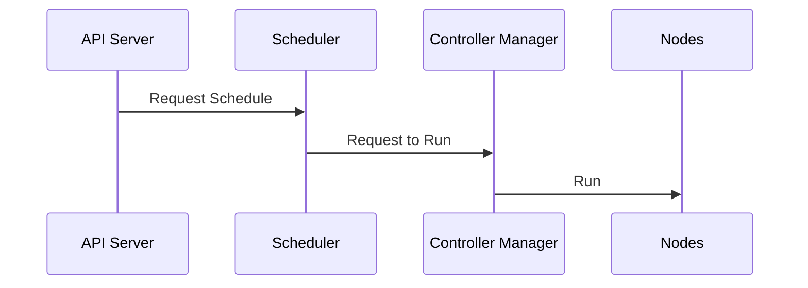
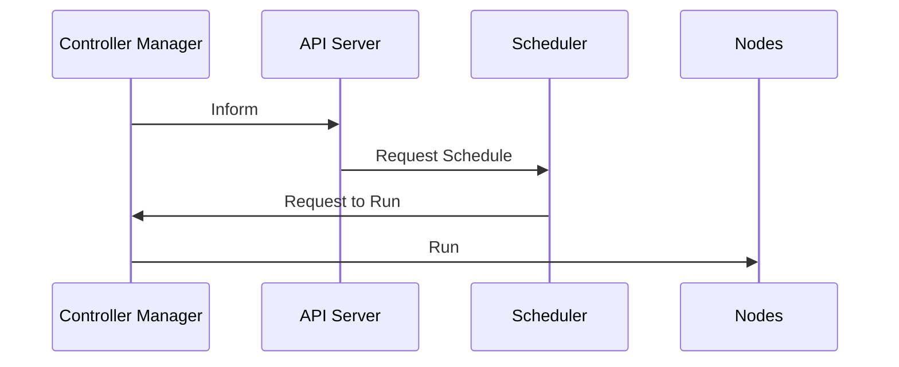
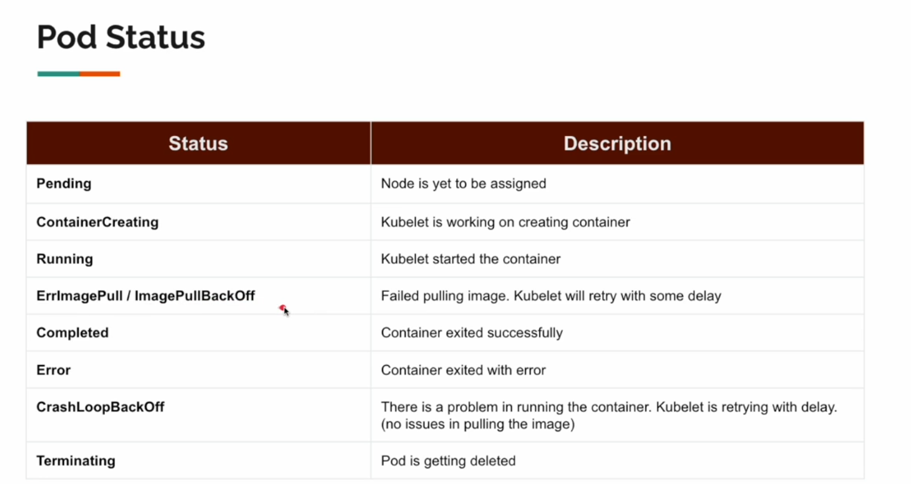
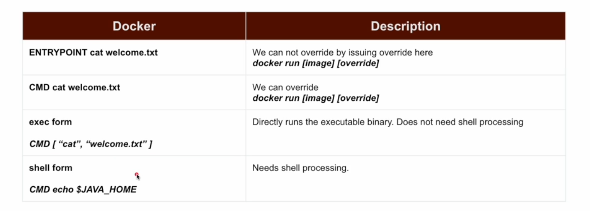
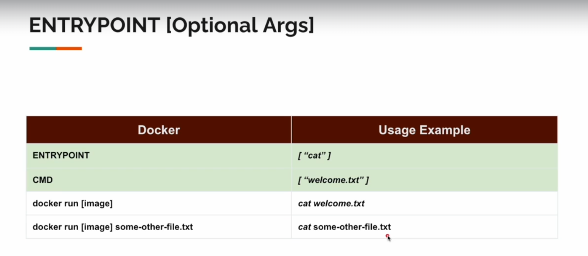
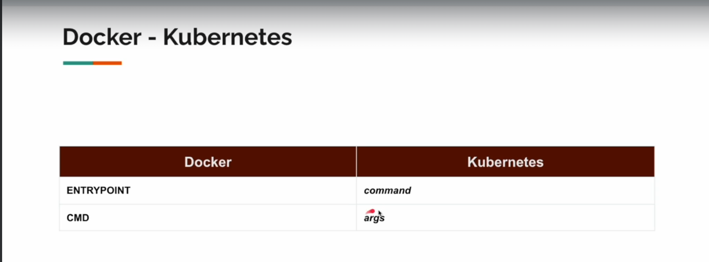

### Terms
1. Workload 
   - application
2. Node 
   - a physical or virtual machine
   - provides the compute resource
3. Pod
   - smallest unit of work in Kubernetes  
   - a K8s abstraction that represents a group of one or more application containers
     - and some shared resources for those containers
   - a pod models application-specific "logical-host"

### FAQS
1. Pod vs Node
   - Pod is the smallest unit of work in Kubernetes  
   - Node is a physical or virtual machine that provides the compute resource
   - a node can run single 

### Kubernetes Cluster

  - Master
    - 1 or more for prod environmetns for high availability
  - Node
    - 5000

#### Control Plane

##### Components
  1. `API Server`
     1. APIS for the client to:
        1.  interact with the cluster
        2.  create workloads
  2. `Scheduler`
     1. workload scheduler
  3. `Controller Manager`
     1. monitors all the work nodes
  4. `etcd`
     1. store all cluster data

##### Notes
  - Only the API Server is exposed to the client
  - Only the API Server calls the Scheduler
  - Only the Scheduler calls the Controller Manager
  - Only the Controller Manager calls the Nodes
  - Controller Manager can call the API Server to request the Scheduler to schedule a new workload

##### Scenarios
   
###### Sample Client wants to create 2 instances of a node container (Client request to API Server)


###### Controller Manager monitors that 1 instance is died (requested was 2)


#### Node

##### Components:
1. `Kubelet`
   1. Waits instructions from the API Server
   2. Agent that runs on each node
   3. Registers the node with the cluster
   4. Watches the API Server for workloads 
      1. **TODO: node can directly communicate with API SERVER???**
   5. Reports back to the API Server
2. `Container Runtime`
   1. Software to run the containers
   2. Docker, containerd, CRI-O
3. `Kube Proxy`
   1. Network proxy
   2. Maintains network rules
   3. Implements part of the services concept

#### Notes
- Kube Proxy is the way nodes communicate with each other
- Kube Proxy also acts like a load balancer
  - it knows when an instance died, it will route the traffic to the other instance
  - it knows what node one container instance is located
    - 1 container instance is not tied to one node -- it can be relocated

### Pods

#### Definition
- Smallest unit of work in Kubernetes
- A pod can run 1 or more container
  - only 1 container will be the main applcation
  - others would be just helper containers
  - `so 1 pod is almost equivalent to 1 application`
- Pod represents a `VM` and containers running on a pod represent the `process`
- inside the pod, all the containers can communicate via only `localhost` (bc. they share the same network namespace)




#### Labels
- help with querying pods
```yaml
apiVersion: v1
kind: Pod
metadata:
  name: pod1
  labels:
    dept: dept-1
    team: team-a
spec:
  containers:
  - name: nginx
    image: nginx
---
apiVersion: v1
kind: Pod
metadata:
  name: pod2
  labels:
    dept: dept-1
    team: team-b
spec:
  containers:
  - name: nginx
    image: nginx
---
apiVersion: v1
kind: Pod
metadata:
  name: pod3
  labels:
    dept: dept-2
    team: team-a
spec:
  containers:
  - name: nginx
    image: nginx
```

```bash
kubectl get pods --show-labels
### query using labels
kubectl get pods -l dept=dept-1
kubectl get pods -l dept=dept-1,team=team-a
```

#### Formatting output
```bash
### o - output
kubectl get pods -o wide
### icnlude the addtnl info
NAME   READY   STATUS    RESTARTS   AGE     IP           NODE           NOMINATED NODE   READINESS GATES
pod1   1/1     Running   0          2m35s   10.244.1.8   kind-worker    <none>           <none>
pod2   1/1     Running   0          2m35s   10.244.2.9   kind-worker2   <none>           <none>
pod3   1/1     Running   0          2m35s   10.244.1.9   kind-worker    <none>           <none>

### yaml format
kubectl get pods -o yaml

### only the yaml part
kubectl get pods -o yaml --export
```

#### PORT FORWARDING
k8s cluster nodes
 - conencted to each other via a network
 - all nodes have a ip address
 - all pods inside the nodes can communicate with each other via a separate network
   - it can communicate with pods outside the node

PORT FORWARDING
  - to access the pod from the local machine (via api server) (using tcp connection)
  - why?? for debugging, testing, etc
```yaml
...
spec:
  containers:
  - name: nginx-container
    image: nginx:1.14.2
    ### this is how you expose a port
    ports:
    - name: "web-port"
      ## what you like to export
      containerPort: 80
      ## default: TCP, POSSIBLE: UDP, SCTP
      protocol: TCP
```

```bash
kubectl port-forward <pod_name> <local_port>:<pod_port>
### this command is live/blocking, so you need to open another terminal
### if you close this terminal, the port forwarding will also be closed
kubectl port-forward my-first-simple-pod 80:80

Forwarding from 127.0.0.1:80 -> 80
Forwarding from [::1]:80 -> 80

### now you can go to 127.0.0.1:80 in your browser (nginx page)
```

#### Restart Policy
- what to do when the container dies

#### Termination Grace Period


#### Accessing pod running in the cluster
- similar to `docker exec` command

```bash
kubectl exec -it <pod_name> -- bash
```

---

### Creating Cluster using Kind and Kube Proxy

#### Kubernetes Resource yaml format
```yaml
# when you kill the pod, it will have a grace period of 0 seconds
# the default value is 30 seconds
terminationGracePeriodSeconds: 0
```


- https://kubernetes.io/docs/reference/kubernetes-api/workload-resources/


```yaml
apiVersion: v1
kind: Kubernetes Workload Type
metadata:
  name for your resource, additional labels
spec:
  this is where you define the configuration of your resource
  this will change depends on the worload
  refer to documentation
```


#### Running a Cluster using Kind
```bash
kind create cluster --config <yaml_dir>
kind create cluster --config sec01-cluster-creation/01-create-cluster.yaml
## THIS WILL ALSO CREATE A NETWORK

## NOTE: BEFORE RUNNING THIS COMMAND
docker ps -a # should not have any container running
docker prune system -a # to remove all the containers

## after creating cluster
docker network ls

NETWORK ID     NAME      DRIVER    SCOPE
b0cd0e02432d   bridge    bridge    local
e274052cf977   host      host      local
3112adeab4bc   kind      bridge    local
f90348792b45   none      null      local

## show the k8s config from kind
cat ~/.kube/config
# kube config is a config file to organize cluster info
# it is in the $HOME/.kube/config
# cat ~/.kube/config


## check the cluster if connected to the server
## this should output the clientVerion, 
## and if it is connected to the server will show also the serverVersion
kubectl verion --output=yaml

## check nodes
kubectl get nodes
NAME                 STATUS   ROLES           AGE     VERSION
kind-control-plane   Ready    control-plane   4h52m   v1.30.0   
kind-worker          Ready    <none>          4h52m   v1.30.0   
kind-worker2         Ready    <none>          4h52m   v1.30.0 


## Creating pods
kubectl create -f sec02-pod/01-simple-pod.yaml
kubectl get pod
NAME                  READY   STATUS              RESTARTS   AGE
my-first-simple-pod   0/1     ContainerCreating   0          48
## Deleting
kubectl delete -f sec02-pod/01-simple-pod.yaml
## Describing
kubectl describe pod <POD_NAME> ## pod name as decribed in the yaml resource file
kubectl describe pod my-first-simple-pod
pod
Name:             my-first-simple-pod
Namespace:        default
Priority:         0
Service Account:  default
Node:             kind-worker2/172.18.0.2
Start Time:       Wed, 03 Jul 2024 13:19:08 +0800
Labels:           <none>
Annotations:      <none>
Status:           Running
IP:               10.244.2.3
IPs:
  IP:  10.244.2.3
Containers:
  nginx-container:
    Container ID:   containerd://ff3dc8bcdf883a07021f8fb729e36d4eeef49a92d06d76e6d9797fe9455fc553
    Image:          nginx:1.14.2
    Image ID:       docker.io/library/nginx@sha256:f7988fb6c02e0ce69257d9bd9cf37ae20a60f1df7563c3a2a6abe24160306b8d
    Port:           80/TCP
    Host Port:      0/TCP
    State:          Running
      Started:      Wed, 03 Jul 2024 13:19:09 +0800
    Ready:          True
    Restart Count:  0
    Environment:    <none>
    Mounts:
      /var/run/secrets/kubernetes.io/serviceaccount from kube-api-access-4twkd (ro)
Conditions:
  Type                        Status
  PodReadyToStartContainers   True 
  Initialized                 True 
  Ready                       True 
  ContainersReady             True 
  PodScheduled                True 
Volumes:
  kube-api-access-4twkd:
    Type:                    Projected (a volume that contains injected data from multiple sources)
    TokenExpirationSeconds:  3607
    ConfigMapName:           kube-root-ca.crt
    ConfigMapOptional:       <nil>
    DownwardAPI:             true
QoS Class:                   BestEffort
Node-Selectors:              <none>
Tolerations:                 node.kubernetes.io/not-ready:NoExecute op=Exists for 300s
                             node.kubernetes.io/unreachable:NoExecute op=Exists for 300s
Events:
  Type    Reason     Age   From               Message
  ----    ------     ----  ----               -------
  Normal  Scheduled  109s  default-scheduler  Successfully assigned default/my-first-simple-pod to kind-worker2
  Normal  Pulled     108s  kubelet            Container image "nginx:1.14.2" already present on machine
  Normal  Created    108s  kubelet            Created container nginx-container
  Normal  Started    108s  kubelet            Started container nginx-container

## Important part is the Events section
## Worker ip address is the node where the pod is running
Node:             kind-worker2/172.18.0.2 # here the worker ip address = 172.18.0.2
## IP address of the pad is
IP:               10.244.2.3

## apply command to apply changes from the yaml file to the cluster


```


What is namespace?
- A way to organize the resources in the cluster

Command similar to watch
```
while true; do clear; kubectl get pods; sleep 3; done
```

ENTRYPOINT vs CMD
- ENTRYPOINT is the command that will be executed when the container starts
- CMD is the default command that will be executed when the container starts
- CMD can be overriden by the user
- ENTRYPOINT can be overriden by the user

exect form vs shell form
- exec form is the form where the command is executed directly
- shell form is the form where the command is executed via a shell
- exec form is preferred because it is faster and more secure
- exec form is the form where the command is executed directly
- shell form is the form where the command is executed via a shell






```bash
kubectl get all
kubectl get pods
kubectl get deploy

kubectl get pods -o wide
kubectl logs deploy/<deployment-name>
## specific container for multi pod deployment
kubectl logs deploy/<deployment-name> -c <container-name>

## port forwarding
## remote port should be explicitly exposed in the resource yaml file
kubectl port-forward <resource> <local_port>:<remote_port>

kubectl apply -f <resource.yaml>

```

---
### Service
- a way to expose the pod to the outside world
- a logical abstraction for a set of Pods
  - and expose them via single stable endpoint
    - stable IP address
    - DNS name

```yaml
apiVersion: v1
kind: Service
metadata:
  # clients can call this name
  name: product-service
spec:
  selector:
    # labels to group the pods
    app: product-service-app
  ports:
    - port: 80 # service port, clients will call this port
      protocol: TCP
      targetPort: 80 # container port, the port where the pod is listening
```


`kube-proxy`
- a simple proxy
- k8s resource Service does not consume CPU or memory
- Not round-robin load balancing. It is random
- Do not expect URL rewriting / path based routing
  - like Ingress