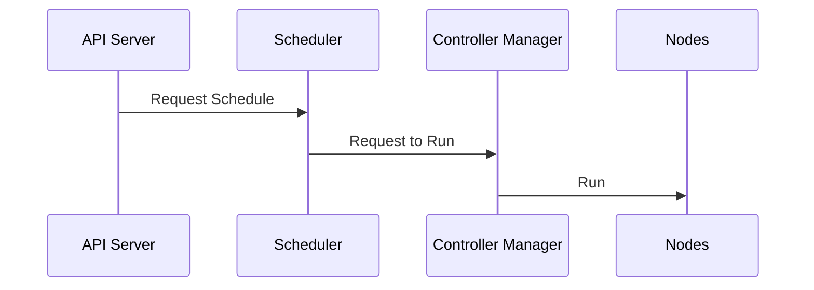
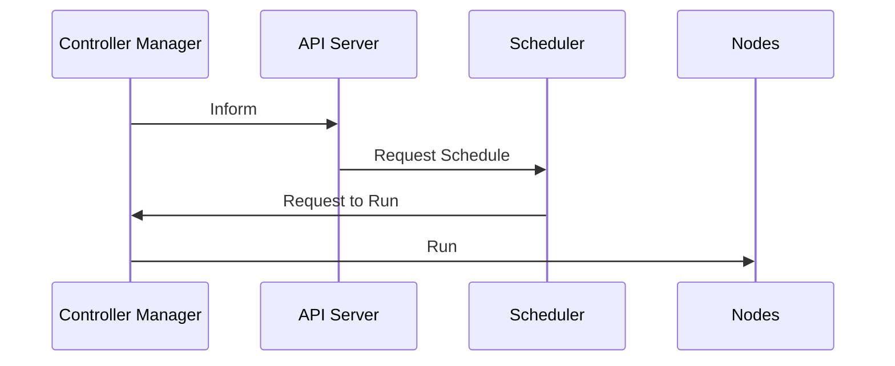

### Kubernetes Cluster
  - Master
    - 1 or more for prod environmetns for high availability
  - Node
    - 5000

Workload
  - application / containerized
  
#### Control Plane

##### Components
  1. `API Server`
     1. APIS for the client to:
        1.  interact with the cluster
        2.  create workloads
  2. `Scheduler`
     1. workload scheduler
  3. `Controller Manager`
     1. monitors all the work nodes
  4. `etcd`
     1. store all cluster data

##### Notes
  - Only the API Server is exposed to the client
  - Only the API Server calls the Scheduler
  - Only the Scheduler calls the Controller Manager
  - Only the Controller Manager calls the Nodes
  - Controller Manager can call the API Server to request the Scheduler to schedule a new workload

##### Scenarios
   
###### Sample Client wants to create 2 instances of a node container (Client request to API Server)

###### Controller Manager monitors that 1 instance is died (requested was 2)

#### Node

##### Components:
1. `Kubelet`
   1. Waits instructions from the API Server
   2. Agent that runs on each node
   3. Registers the node with the cluster
   4. Watches the API Server for workloads 
      1. **TODO: node can directly communicate with API SERVER???**
   5. Reports back to the API Server
2. `Container Runtime`
   1. Software to run the containers
   2. Docker, containerd, CRI-O
3. `Kube Proxy`
   1. Network proxy
   2. Maintains network rules
   3. Implements part of the services concept

#### Notes
- Kube Proxy is the way nodes communicate with each other
- Kube Proxy also acts like a load balancer
  - it knows when an instance died, it will route the traffic to the other instance