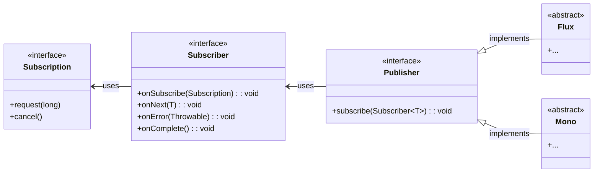
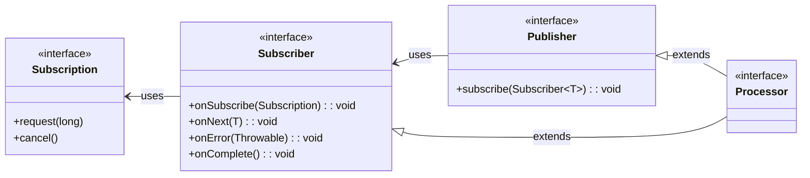

# JOSH LONG - REACTIVE SPRING

## Reading a file Synchronously

```java
class Synchronous implements Reader {
  
  @Override
  public void read (
    File file, Consumer<Bytes> consumer, Runnable f
  ) throws IOException {
    try (FileInputStream in = new FileInputStream(file)) {
      byte[] data = new byte[FileCopyUtils.BUFFER_SIZE];
      int res;
      while((res = in.read(data, 0, data.length)) != -1) {
        consumer.accept(Bytes.from(data, res));
      }
      f.run();
    }
  }
}
```
- What is wrong with this code?
  - It is working IF:
    - there is the file needed
    - and the hard drive is working
  - What if used a different implementation of `InputStream` and read data from a network socket
  - What happens if the network is slow or down


### The Reactive Streams Initiative
  - What we want:
    - maps something to asynchronous I/O (By JDK)
    - supports `push-back` mechanism
    - or `flow-control` in distributed systems
  - Projects that support Reactive Programming
    - Vert.x
    - Akka Streams
    - RxJava 2
    - Reactor for Project Stream
  - De Facto standard -> The `Reactive Streams` initiative
  - It defines 4 types
    - **`Publisher<T>`**
      - a producer of values that may eventually arrive
      - a `Publisher<T>` produces values of type `T` to a `Subscriber<T>`
      - ```java
        package org.reactivestreams

        public interface Publisher<T> {
          void subscribe(Subscriber<? super T> s)
        }
        ```
    - **`Subscriber<T>`**
      - subscribes to a Publisher<T>
      - receives notifications on any new values of type `T` through its `onNext()`
      - if errors are called, `onError(Throwable)` is called
      - ```java
        public interface Subscriber<T> {
          void onSubscribe(Subscription s);
          void onNext(T t);
          void onError(Throwable t);
          void onComplete();
        }
        ```
    - **`Subscription`**
      - When a `Subscriber` first connects to a `Publisher`
        - it is given a `Subscription` in the `Subscriber::onSubscribe`
      - `Subscription` enables `backpressure`
        - Subscriber uses:
          - `Subscription::request` method to request more data, `long n` more times, or Long.MAX_VALUE which is effective unlimited
          - `Subscription::cancel` to halt the processing
      - ```java
        public interface Subscription {
          void request(long n);
          void cancel();
        }
        ```
    - **`Processor`**
      - ```java
        public interface Processor<T, R> extends Subscriber<T>, Publisher<R> {

        }
        ```
  - UML Diagram

    - ```mermaid
      classDiagram
          class Publisher {
              +subscribe(s)
          }
          class Subscriber {
              +onSubscribe(s)
              +onNext(t)
              +onError(t)
              +onComplete()
          }
          class Subscription {
              +request(n)
              +cancel()
          }
          class Processor {
              +onSubscribe(s)
              +onNext(t)
              +onError(t)
              +onComplete()
          }

          Publisher --|> Subscriber : implements
          Processor --|> Subscriber : implements
          Processor --|> Publisher : implements
          Subscriber --|> Subscription : has
      ```

### The Reactive Streams Specifications
  - Components
    - `Publisher`
      - broadcasts data of type T to a Subscriber
    - `Subscriber`
      - As soon as Subscriber subscribes, it receives a Subscription
      - uses Subscription to request more data
      - Subscriber(NOT Publisher) controls the flow of the data, the rate of processing
        - Publisher will not produce more data than the ammount for which the subscriber has asked
    - `Subscription` 
      - is a link between producer and consumer, the Publisher and Subscriber
      - new Subscriber instances create new Subscription instances
      - allows the subscriber to request more data when its ready to process the data - `FLOW CONTROL - aka BACKPRESSURE`
    - `Processor`
      - Acts as a bridge, implementing both Publisher<T> and Subscriber<T>
      - It is a `producer` and a `consumer`, a `source` and a `sink`
    - `FlowAdapters` - a concrete class that helps adapt Reactive Streams types interchangeably to and from the Java 9 Flow analogs
  - Related techs
    - Message Queues like Apache Kafka, or Rabbit MQ
      - MQs are critical component of Distributed Systems
        - They ensure that decoupled components remain alive by buffering the messages
          - Message Buffering - stores the message until consumer is ready to process them
          - This allows consumers to consume the messages as they can, and no faster
        - This regulated consumption of data is `flow control`
    - Network Programming using TCP/IP or UDP
        - 
### Why try-catch is bad for reactive programming
  - it is synchronous by nature
    - try catch blocks the execution
  - reactive programming is asynchronous
    - it needs the data to be flowing continously


### Creating New Reactive Streams
```java
public class SimpleFluxFactoriesTest {
  @Test
  public void simple() {

    // 1. Create a new Flux whose values are in a (finite) range
    Publisher<Integer> rangeOfIntegers = Flux.range(0, 10);
    StepVerifier.create(rangeOfIntegers).expectNextCount(10).verifyComplete();

    // 2. Create a new Flux whose values are the literal strings A, B, C
    Flux<String> letters = Flux.just("A", "B", "C");
    StepVerifier.create(letters).expectNext("A", "B", "C").verifyComplete();

    // 3. Create a new Mono whose single value is a java.util.Date
    long now = System.currentMillis();
    Mono<Date> greetingMono = Mono.just(new Date(now));
    StepVerifier.create(greetingMono).expectNext(new Date(now)).verifyComplete();

    // 4.Create an Empty Mono
    Mono<Object> empty = Mono.empty();
    StepVerifier.create(empty).verifyComplete();

    // 5. Create a Flux whose elements come from a Java Array
    Flux<Integer> fromArray = Flux.fromArray(new Integer[] { 1, 2, 3 });
    StepVerifier.create(fromArray).expectNext(1, 2, 3).verifyComplete();

    // 6. Create a Flux whose elements come from a Java Iterable, which describes among other things all java.util.Collection subclasses like List, Set, etc.
    Flux<Integer> fromIterable = Flux.fromIterable(Arrays.asList(1, 2, 3)); 
    StepVerifier.create(fromIterable).expectNext(1, 2, 3).verifyComplete();

    // 7. Create a new Flux from a Java 8 Stream
    AtomicInteger integer = new AtomicInteger();
    Supplier<Integer> supplier = integer::incrementAndGet;
    Flux<Integer> integerFlux = Flux.fromStream(Stream.generate(supplier));
    StepVerifier.create(integerFlux.take(3))
        .expectNext(1)
        .expectNext(2)
        .expectNext(3)
        .verifyComplete();
  }
}
``` 

### Conversion From Reactive Stream types to Jdk Flow types
```java
public class FlowAndReactiveStreamsTest {
  
  @Test
  public void convert() {

    // demonstrates converting to and from Reactive Streams types with the Reactive Streams conversions
    // Flow is define by JDK
    // FlowAdapter is use to convert from Jdk Flow.Publisher to Reactive Streams Publisher
    Flux<Integer> original = Flux.range(0, 10);
    Flow.Publisher<Integer> rangeOfIntegersASJdk9Flow = FlowAdapters.toFlowPublishers(original);
    Publisher<Integer> rangeOfIntegersASReactiveStream = FlowAdapters.toPublisher(rangeOfIntegersAsJdk9Flow);
    StepVerifier.create(original).expectNextCount(10).verifyComplete();
    StepVerifier.create(rangeOfIntegersAsReactiveStream).expectNextCount(10).verifyComplete();

    // demonstrates converting to and from Reactor FLux<T> and Mono<T> using Reactor conversions
    Flux<Integer> rangeOfIntegersAsReactorFluxAgain = JdkFlowAdapter.flowPublisherToFlux(rangeOfIntegersAsJdk9Flow);
    StepVerifier.create(rangeOfIntegersAsReactorFluxAgain).expectNextCount(10).verifyComplete();
  }
    
}
```

### Processors
```java
public class EmitterProcessorTest {
  
  @Test
  public void emitterProcessorTest() {
    EmitterProcessor<String> processor = EmitterProcessor.create();
    producer(processor.sink());
    consume(processor);
  }

  private void produce(FluxSink<String> sink) {
    sink.next("1");
    sink.next("2");
    sink.next("3");
    sink.complete();
  }

  private void consume(Flux<String> publisher) {
    StepVerifier
        .create(publisher)
        .expectNext("1")
        .expectNext("2")
        .expectNext("3")
        .verifyComplete();
  }
}

```

### Reactive Streams API


### Java 9 Flow API
